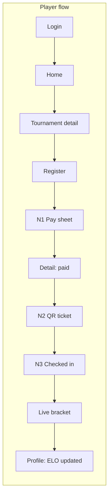
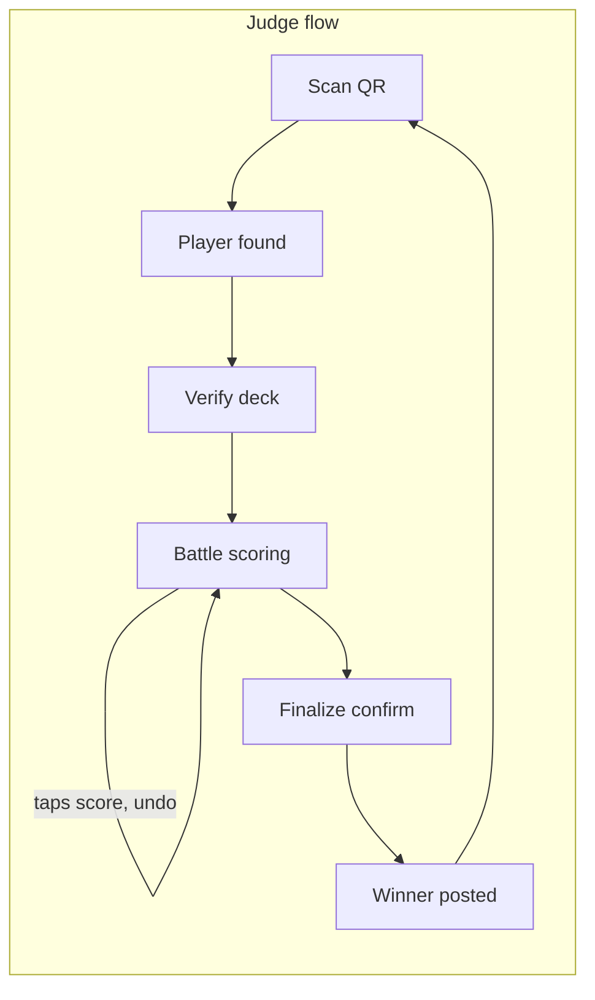
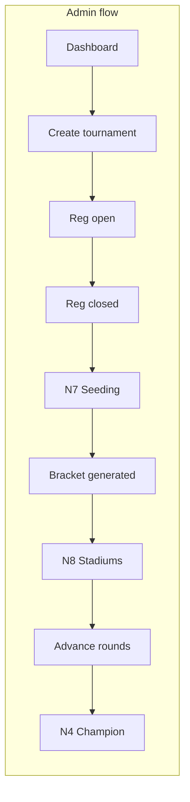

# Interactive Prototype Plan — SEKOCI Arena

> Design prototype, not code. Lives as a Claude artifact (single HTML). Purpose: validate the three critical flows click-by-click before React Native build, and serve as the pixel reference during Phases 2-6.

Artifact: https://claude.ai/code/artifact/b93cfc99-da1e-441d-80f6-9b07c2b3f217

## Done criteria

- All three flows tap-through end to end inside phone/desktop frames, no dead buttons on the flow path.
- Judge scoring is stateful: taps change scores, undo works, finalize gates on threshold.
- Theme picker recolors every screen (existing behavior, must survive).
- Reduced-motion clean on every animated element.
- Each screen matches the locked design system (tokens, radius lock, mono numerals, semantic colors fixed).

## Screen inventory

Existing (v5): login, register, player home, tournament detail, live bracket, judge scan, deck verify, battle scoring, deck builder, part picker, admin dashboard (+branding), tournament create, payments, analytics, leaderboard, profile, landing.

New screens to build (8):

| # | Screen | Frame | Flow |
|---|---|---|---|
| N1 | Midtrans pay sheet (Snap mock in WebView frame) | phone | Player |
| N2 | QR ticket (registration QR + status) | phone | Player |
| N3 | Check-in confirmed state | phone | Player |
| N4 | Champion celebration (the one big-motion moment) | phone | Player/Admin |
| N5 | Community page (themed in community accent) | phone | Player |
| N6 | Swiss standings table | desktop | Admin |
| N7 | Seeding list (ELO-sorted, drag placeholder) | desktop | Admin |
| N8 | Stadium assignment board | desktop | Admin |

Deliberately skipped: parts CRUD, settings, password reset, email templates. Zero design risk, build-phase trivia.

## Flow maps

## Interaction spec

- In-frame navigation: buttons on the flow path swap screens inside the same device frame (JS show/hide), with a small flow progress strip above the frame (step dots).
- Gallery tabs stay for direct access to any screen.
- Scoring screen: player column tap selects, finish buttons add to selected player's score + push history row, undo pops, finalize enabled at 4+ points (visual rule only).
- No fake latency, no loading spinners in prototype - skeletons shown as separate states only where designed.

## Hero visual track

- v5 (current): layered SVG/CSS clash - accent-reactive, ships everywhere.
- 3D exploration: separate artifact, Three.js inlined (CSP forbids CDN), two metallic beys with true geometry, lighting, spin + clash + sparks. If approved, becomes landing hero: Three.js on Expo web, expo-gl on native, SVG clash as reduced-motion/low-power fallback.
- Photoreal raster: no image-gen tool in this environment. If wanted: generate externally (Figma Make / Midjourney), embed as data URI layer.

## Order of work

1. 3D hero exploration artifact (separate, user comparing)
2. N1-N3 player payment/QR screens + player flow wiring
3. Judge flow wiring + stateful scoring
4. N6-N8 admin screens + admin flow wiring
5. N4 champion celebration + N5 community page
6. Final pass: reduced motion, theme sweep, dead-button audit
