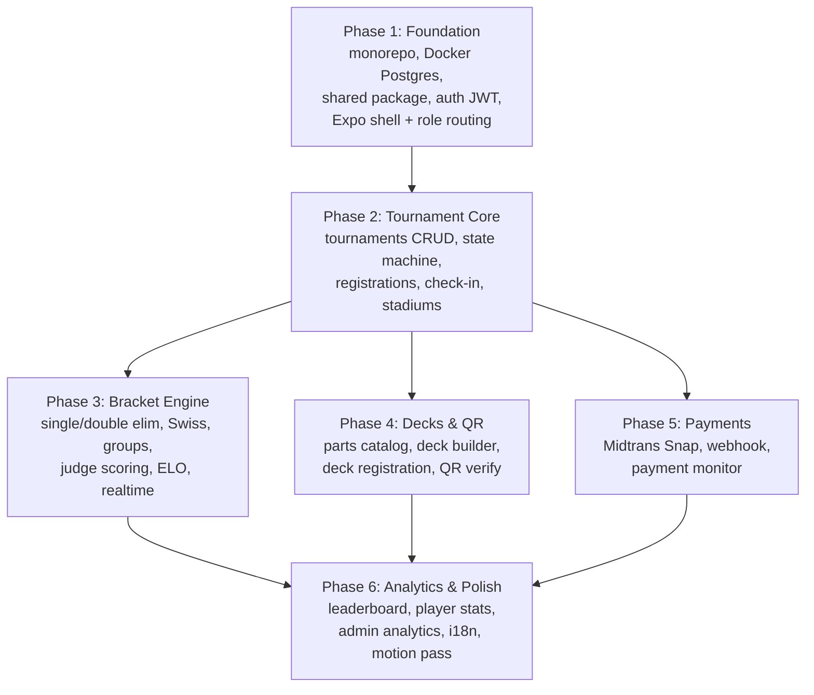
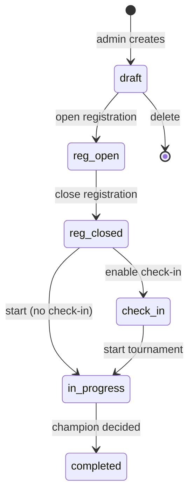
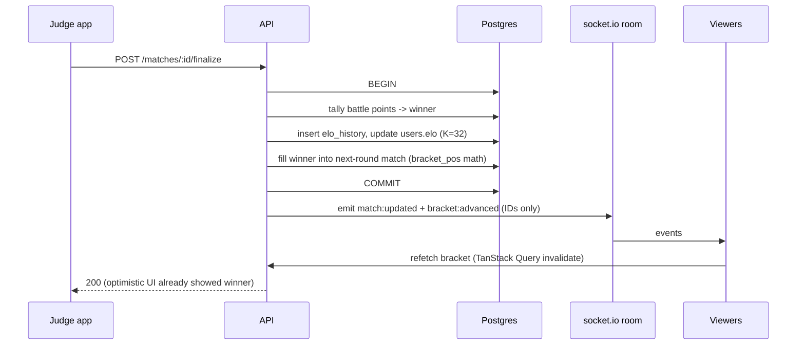
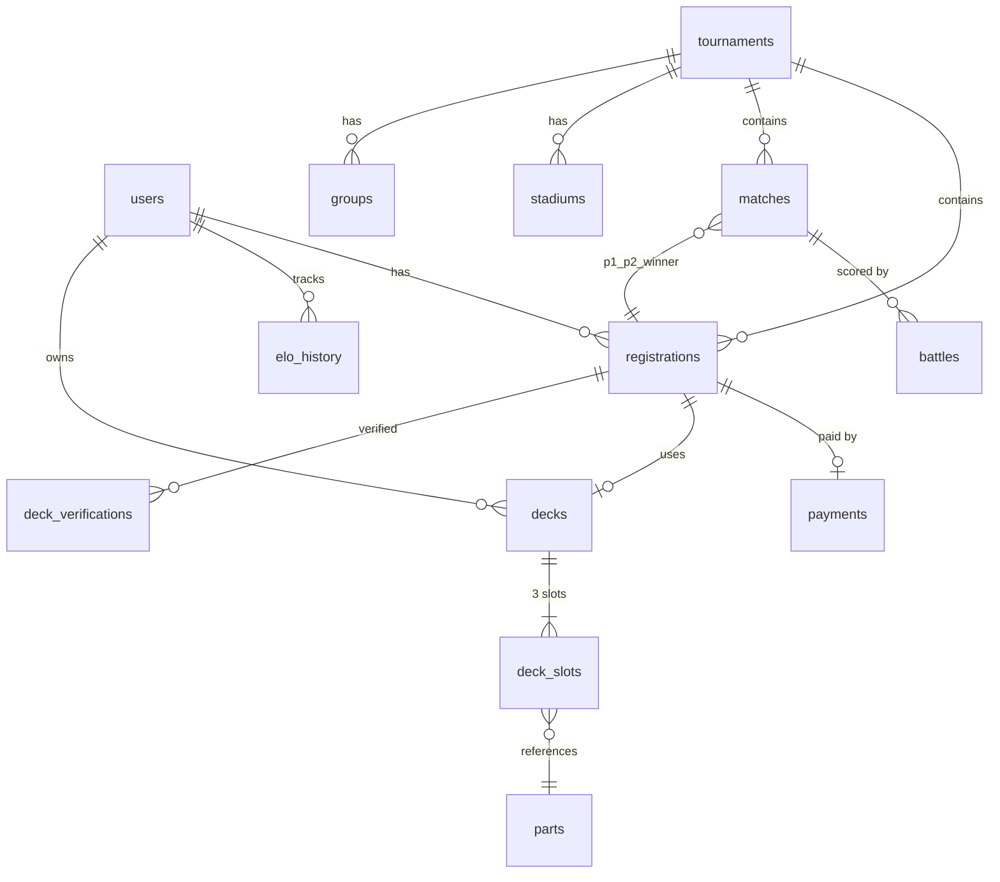

# Remake Roadmap — React Multiplatform + PostgreSQL

> Master roadmap. Each phase has (or will get) its own detailed plan in this directory.
> Spec: `docs/superpowers/specs/2026-08-12-react-postgres-remake-design.md`

**Goal:** Rebuild the Beyblade X tournament platform as Expo (iOS/Android/web) + Fastify + Drizzle + PostgreSQL, full feature parity plus relational analytics.

## Phase dependency graph

Phases 3, 4, 5 are independent of each other after Phase 2 — build in any order or parallel worktrees.

## Tournament lifecycle state machine

All transitions via `POST /tournaments/:id/status`. Anything else = 409 + current status.

## Match finalize sequence (the critical transaction)

## Entity relationships (core)

## Phase plans

| Phase | Plan file | Status |
|---|---|---|
| 1 Foundation | `2026-08-12-phase1-foundation.md` | written |
| 2 Tournament Core | written when Phase 1 done | pending |
| 3 Bracket Engine | written when Phase 2 done | pending |
| 4 Decks & QR | written when Phase 2 done | pending |
| 5 Payments | written when Phase 2 done | pending |
| 6 Analytics & Polish | written when 3-5 done | pending |

Each later plan is written against the real code of its predecessors — no stale-plan drift.

## Definition of done per phase

- Phase 1: `pnpm dev` boots Postgres + API + Expo; register/login works on web + native; role routing sends admin/judge/player to their route groups; CI green.
- Phase 2: admin creates tournament, walks the full status state machine; players register; check-in works; 409s on illegal transitions proven by tests.
- Phase 3: 8-player single-elim E2E test passes: bracket generated, judge scores battles, finalize advances rounds, champion + correct ELO. Double elim, Swiss, groups property-tested. Live bracket updates via socket.
- Phase 4: player builds deck from parts catalog, attaches to registration, judge scans QR, resolves registration, approves deck.
- Phase 5: sandbox Midtrans payment settles a registration via webhook; idempotency proven; payment monitor lists live.
- Phase 6: leaderboard, player stats graphs, admin analytics endpoint, EN/ID i18n complete, motion pass through `animate`/`review-animations` skills.
